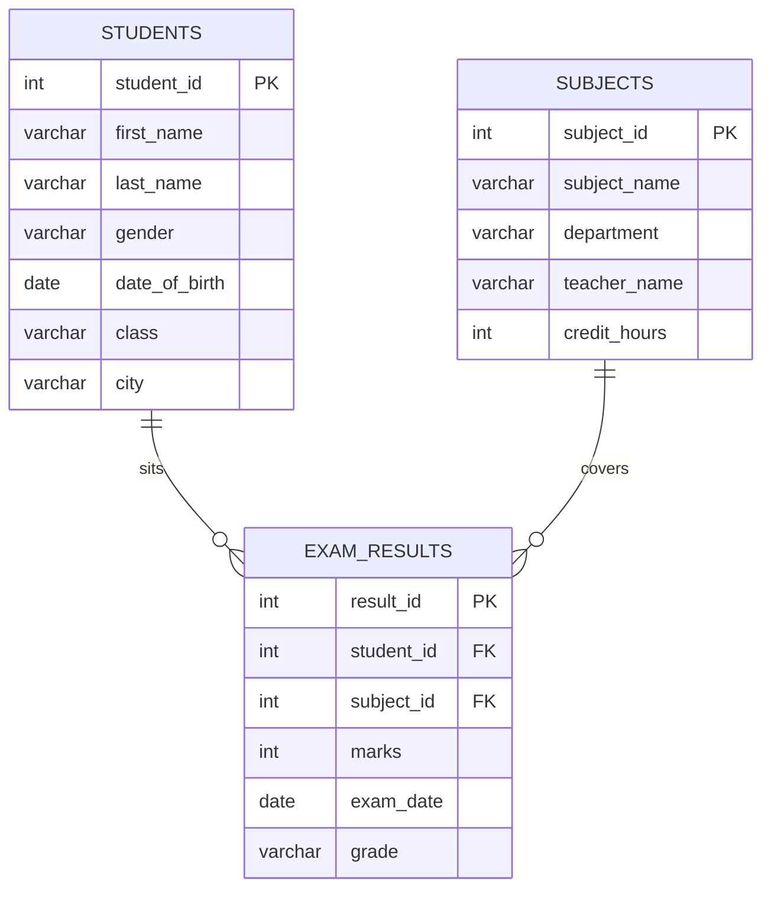

# Nairobi Academy School Database

A relational database built for a fictional secondary school — designed from
scratch, then populated and queried to answer the kind of day-to-day
questions a school administrator would actually ask.

## Scenario

> Nairobi Academy is a secondary school in Nairobi. As the new database
> administrator, the task is to build the school's database from scratch and
> start querying it — tracking students, the subjects on offer, and exam
> results.

## Data model

Schema name: `nairobi_academy`



Three tables:

| Table | Purpose |
|---|---|
| `students` | One row per enrolled student: name, gender, date of birth, class, city. |
| `subjects` | One row per subject offered: name, department, teacher, credit hours. |
| `exam_results` | One row per exam sitting: links a student to a subject with marks, date, and grade. |

The schema went through a couple of revisions after the initial design — a
`phone_number` column was added to `students` and then removed again, and
`subjects.credits` was renamed to `credit_hours`. Those changes are captured
as `ALTER TABLE` statements in `DDL.sql` rather than folded silently into the
original `CREATE TABLE`, so the schema's actual history is visible.

## Repository structure
'''text
nairobi-academy-school-database/
├── README.md 
├── DDL.sql ← Section A: CREATE SCHEMA, CREATE TABLE, ALTER TABLE
├── DML.sql ← Section B: INSERT, UPDATE, DELETE
└── DQL.sql ← Section C: SELECT 
## How to run this

Run the files **in order** — each one depends on the last:

```bash
psql -U your_username -d your_database -f DDL.sql
psql -U your_username -d your_database -f DML.sql
psql -U your_username -d your_database -f DQL.sql
```

`DDL.sql` builds the schema and tables. `DML.sql` loads the sample data and
applies two corrections (a student's city, a mistyped mark) plus one
cancellation. `DQL.sql` holds every query, each commented with the question
it answers — individual queries can also be copied out and run on their own.
